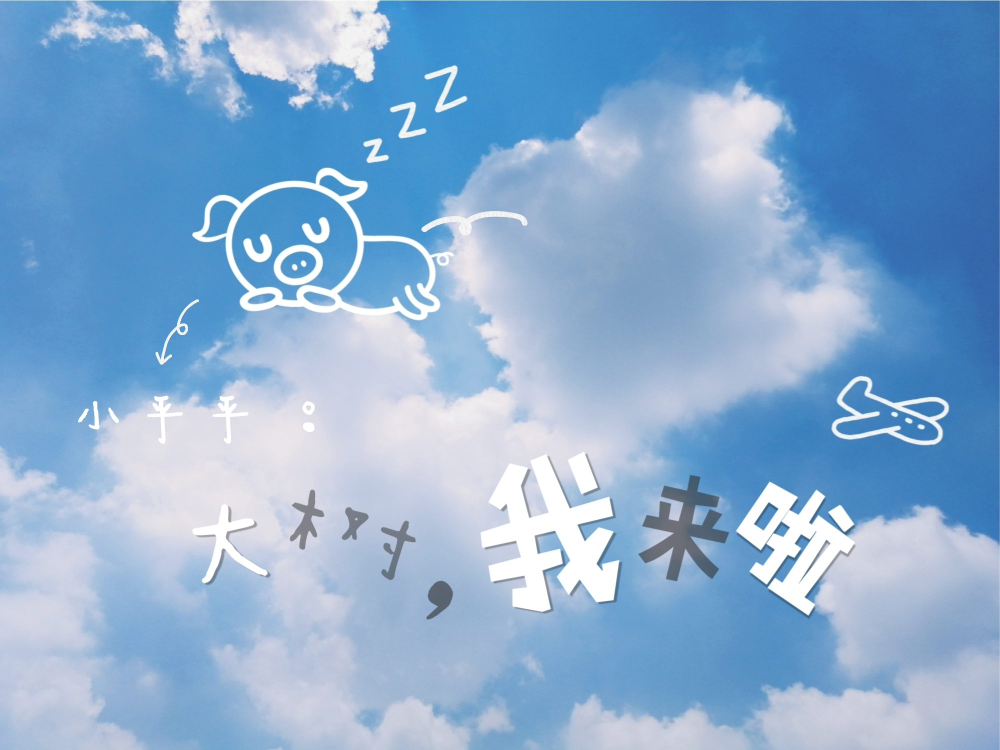

# 育儿就是父母在自导自演一场“攻坚战”

亲爱的小乎乎：
 
这是你老爸写给你的第二封家书。
 
今天来聊聊关于“小孩子教育”当中对父母的要求。
 
自从有了你之后，我和你妈争论最多的一个问题便是：在最初的几年当中，是把你放在老家，还是让你跟在我们身边。
 
其实，这个问题根本不用争论的，我们心里早就有一个确定的答案：孩子一定要亲自带，父母的一言一行才是孩子的第一老师。
 
之所以要争论，实则是争论的两种养娃的模式，而归根结底则是孩子父母的责任心与认知水平。
 
在你老爸从小生活的那个环境中，大多数家庭似乎都遵循着同样的生存轨迹：
 
青年男女结婚的年龄越来越早，但无论是经济上，还是养育孩子的水平上都没有准备好。结果便是，小两口都外出打工，将娃娃留在家里，让老人照顾，而老人的教育模式还停留在上一代，保持着“最低”的标准----只要健健康康的就好，其他的一切从简，根本谈不上“教育”。
 
由于教育上的缺失，（这里指的是学前教育，或者叫做第一性教育）新的一代在娇惯宠溺中长大，无论是婴幼儿期应该养成的习惯，还是这个时代当下应该有的基础文化知识，都没能够跟得上。最终缺失的，不仅是父母在教育孩子的“岁月”当中通过“履行责任”应该有的自我成长，还有下一代应该有的起跑线。
 
还记得当年上高中时，有一个同学他爸妈都是生意人，平时根本没时间照顾他，更没时间关注他的教育。直到高中时，有了自己的空间，每每放假时，我们都回家而他总是一个人去网吧。有次好奇，问起为什么不回家，得到的答案是，反正爸妈也不回家，回去也是一个人，干脆去打游戏。
 
后来的情况是，高考落榜，专科都没考上，至于他去了哪里，由于断了联系，至今不得而知。
 
见多了生活中父母们在教育孩子上的“不作为”：有些父母是因为生活所迫，有工作、生意要忙，确实没太多精力照顾孩子，有些父母是因为真的缺乏责任心而没有意识去主动教育下一代，还有些父母是因为自己本身没有受过高等教育在下一代教育上力不从心。
 
 
当轮到我自己时，心里其实是打鼓的，一方面确实是没有经验，另一方面真的很担心到时候自己也由于某些客观原因，在孩子早年教育方面尽不到责任。
 
不过好在当下的环境已经完全发生了变化。一方面，自己是受过教育的知识分子，一方面目前所生活的环境已经今非昔比，还有一方面，出现在我生活当中的好多人，在自我教育方面就要求非常高，写作、健身、听《得到》，努力工作，似乎无时无刻不在严格要求自己。
 
所以，在当下的这个大环境下，我的积极性还是能够保持住的。
 
我一贯的理念便是：身体力行，言传身教，父母要成为孩子的榜样!
 
非常期待与你的一同成长，但在这之前，我得非常非常努力才行。

